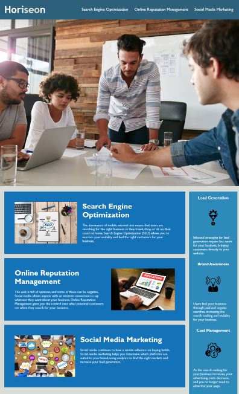

# Module 1 challenge

## Project Overview

This project aims to develop a codebase for a marketing agency's website that strictly adheres to accessibility standards. By ensuring compliance with these standards, the website will be optimized for search engines, enhancing visibility and user experience.

## ScreenShot
This is what the final output will look like.

## Link to website
https://tinaika19.github.io/Challenge_1/

